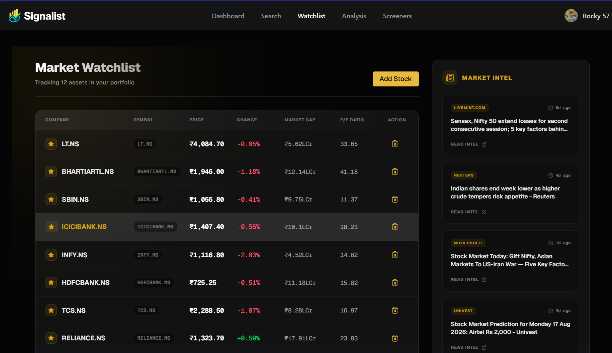
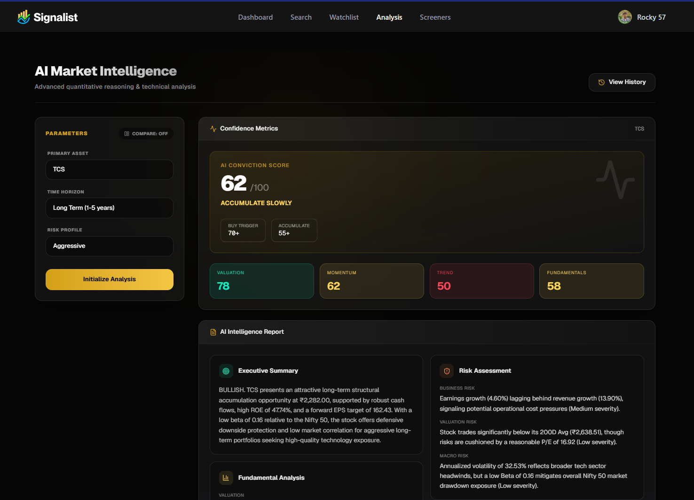

# AI-Powered Stock Market Analysis Platform

A compact, opinionated Next.js dashboard for stock tracking, news aggregation, and on-demand analysis — built with TypeScript, Tailwind CSS, MongoDB, and an agentic AI analysis pipeline powered by LangGraph + Gemini. 🚀

[](https://example.com) [](https://example.com) [](https://stock-market-sandy.vercel.app)

---

## Visuals

Below are curated screenshots that showcase the main flows and UI of the app. Each image is presented individually with a short caption to make the README cleaner and easier to scan.

### Dashboard

A high-level market overview with TickerTape and heatmap, designed for quick monitoring.

---

### Watchlist

Personal watchlist with real-time prices, quick actions, and latest related news.

---

### Stock Screener

Filter and discover stocks using multiple criteria and exportable results.

---

### Stock Page

Detailed single-stock view with charts, fundamentals, and technical indicators.

---

### Stock Analysis

Agentic AI analysis output (LangGraph + Gemini) shown as structured markdown insights.

---

### Login Page

Clean authentication UI with email/password signup and contextual onboarding.

---

> Add the PNG files to `public/assets/readme_images/` so screenshots render in the README.

Live demo: https://stock-market-sandy.vercel.app

---

## The Why

Investors and traders need a lightweight, fast interface to monitor prices, collect news, and keep personal watchlists without the overhead of heavy trading platforms. Stock Markett provides:

- A single-pane dashboard for quick stock lookups and visualizations
- Persistent user watchlists and signup flows
- High-quality AI stock analysis and reporting

This project is a powerful demonstration of modern full-stack capabilities: secure authentication, persistent storage, real-time data integration, agentic AI workflows, and a highly responsive React UI.

---

## Key Features

- **Next.js App Router + TypeScript** — modern SSR/SSG and clean type-safety across the stack.
- **Persistent Watchlist (MongoDB + Mongoose)** — users can save & manage watchlists stored in MongoDB.
- **Auth with Better Auth** — email/password auth with `better-auth` and cookie-based session handling.
- **Real-Time Trading UIs** — embedded TradingView widgets and TickerTape components for interactive, real-time market charts.
- **AI Stock Analysis (LangGraph + Gemini)** — agentic analysis pipeline using `@langchain/langgraph` and `@langchain/google-genai` to orchestrate data-fetch → LLM analysis nodes.
- **Market Data APIs** — Aggregates real-time data from Yahoo Finance and Google News for comprehensive financial metrics, technical indicators, and live market context.

---

## AI Stock Analysis (LangGraph Agentic Workflow)

This project implements an advanced agentic, state-graph workflow for per-symbol AI-driven analysis located at [app/api/stock-analysis/route.ts](app/api/stock-analysis/route.ts). The pipeline has been significantly upgraded to provide professional-grade, actionable insights:

- **3-Node Orchestration**: A LangGraph `StateGraph` runs `fetch_stock` and `fetch_news` in parallel to gather quantitative metrics and real-time market context, followed by the `analyze` node.
- **News Decoupling**: The AI relies purely on technical/fundamental data, while real-time news is streamed to the client separately to prevent context hallucination.
- **Richer Technical Data**: The `fetch_stock` node computes advanced indicators including EMA (12 & 26), MACD crossovers, Bollinger Bands, and Volume Trends (modularized in `lib/utils/technical-indicators.ts`).
- **Peer & Industry Context**: The AI actively compares the target stock's valuation (P/E, ROE, margins) against top sector peers (e.g., TCS vs INFY) to ground its analysis.
- **Batch Query Optimizations**: Heavy use of `Promise.all` and Yahoo Finance's batch API (`yahooFinance.quote([symbols])`) to eliminate network request waterfalls and fetch fallback/search data in a single network pass.
- **Streaming Structured JSON**: Uses LangChain's `.stream()` API to stream strict, validated JSON directly to the frontend. This creates a ChatGPT-like real-time typing experience, eliminating long loading spinners.
- **MongoDB Caching**: Analysis results are stored in a MongoDB `AnalysisCache` collection with a 1-hour TTL. Repeat requests load instantly, saving Gemini API costs.
- **Sector-Aware UI Scoring**: The client-side dashboard dynamically scores the stock using sector-specific P/E benchmarks (e.g., scoring a P/E of 60 differently for Tech vs Banks).
- **Analysis History & Comparison**: Users can revisit past analyses stored in the database or run side-by-side comparison modes to evaluate two stocks against each other.
- **Actionable Prompt Engineering**: The Gemini LLM is prompted with strict SEBI-analyst constraints to return precise numbers, trigger levels, and concrete Bull & Bear case scenarios instead of vague advice.

Example request (curl):

```bash
curl -X POST http://localhost:3000/api/stock-analysis \
	-H "Content-Type: application/json" \
	-d '{"symbol":"TCS", "timeframe":"medium", "riskProfile":"balanced"}'
```

Response (trimmed): JSON containing `symbol`, `timeframe`, `riskProfile`, `stockData` (snapshot) and `analysis` (markdown string).

---

---

## Tech Stack

Frontend

- Next.js (App Router)
- React 19 + TypeScript
- Tailwind CSS

Backend

- Node.js (Next.js API routes)
- `better-auth` for authentication

Database / Tools

- MongoDB (Mongoose)
- Yahoo Finance / Google News RSS / Gemini AI (integration points)
- ESLint, TypeScript, Tailwind CSS, Turbopack

---

## Getting Started

### Prerequisites

- Node.js 18+ (or latest LTS)
- npm (or yarn/pnpm)
- A running MongoDB instance (Atlas or local)

### Installation

```bash
git clone <your-repo-url>
cd stock_market
npm install
# or: pnpm install
```

### Environment

Create a `.env` from the template and fill in values:

```env
# MongoDB connection string
MONGODB_URI=mongodb+srv://<user>:<pass>@cluster.example.mongodb.net/stock_market

# Better Auth configuration
BETTER_AUTH_SECRET=replace_me_with_a_strong_random_secret
BETTER_AUTH_URL=http://localhost:3000

# Gemini API key used for Stock Analysis
GEMINI_API_KEY=replace_with_gemini_api_key

# Optional: NODE_ENV (development|production)
NODE_ENV=development
```

Save the file as `.env` at project root.

### Run (dev)

```bash
npm run dev
# Visit http://localhost:3000
```

### Build & Start (production)

```bash
npm run build
npm start
```

---

## Architecture / Project Structure

Top-level layout (trimmed):

- `app/` — Next.js App Router pages and layouts
- `components/` — UI components and widgets (TradingView, TickerTape, Watchlist UI)
- `lib/` — client libraries, API wrappers, and server actions
- `database/` — MongoDB connection (`mongoose.ts`) and models (`models/*.ts`)
- `hooks/` — React hooks (`useDebounce`, TradingView hook)
- `api/` — server API routes used by client pages (`/api/news`, `/api/stock-analysis`)

Example important files:

- [database/mongoose.ts](database/mongoose.ts) — MongoDB connection helper
- [lib/better-auth/auth.ts](lib/better-auth/auth.ts) — authentication setup
- [components/WatchlistTable.tsx](components/WatchlistTable.tsx) — watchlist UI

---

## Future Roadmap

1. Add OAuth providers (Google/GitHub) via `better-auth` for faster onboarding.
2. Real-time WebSocket feed for live quotes and push notifications.
3. Advanced analytics: portfolio P&L, historical charts, and export CSVs.
4. CI/CD + Vercel deployment template with preview environments and test coverage reporting.

---

## Contact / Support

- GitHub: https://github.com/your-username/stock_market
- LinkedIn: https://www.linkedin.com/in/your-name
- Email: your.email@example.com
