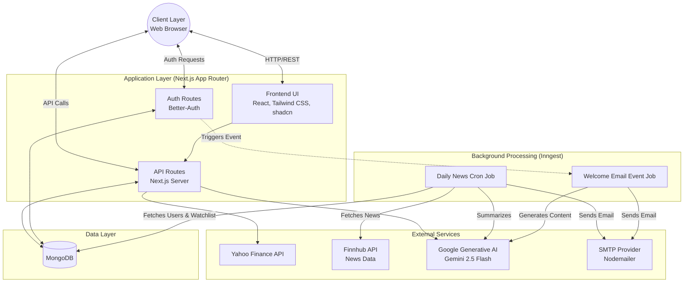
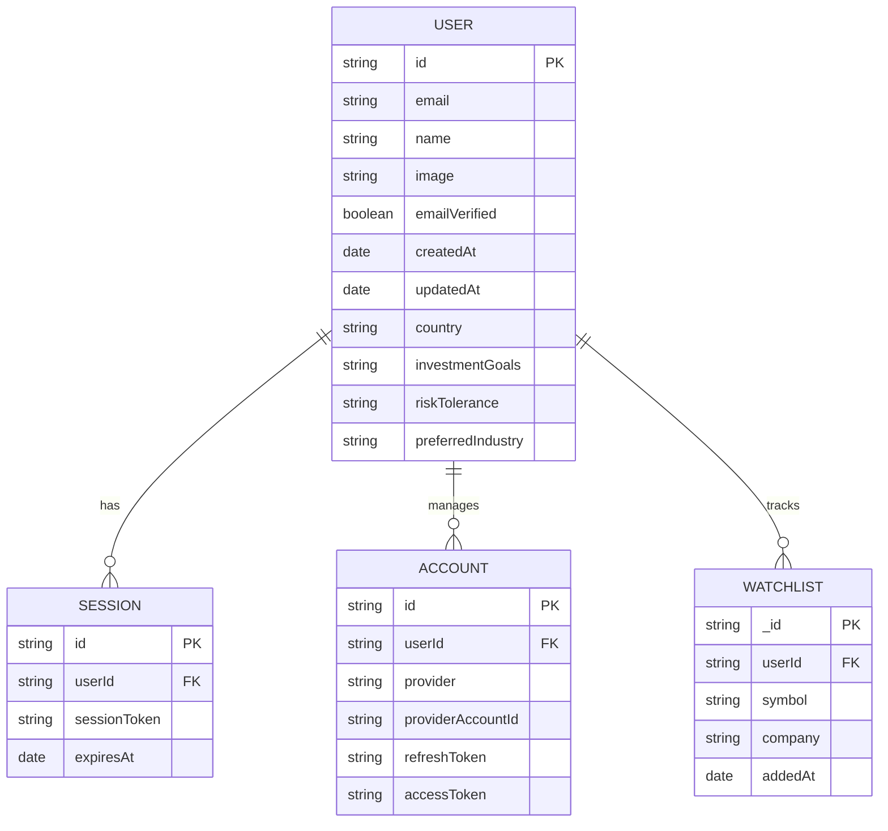
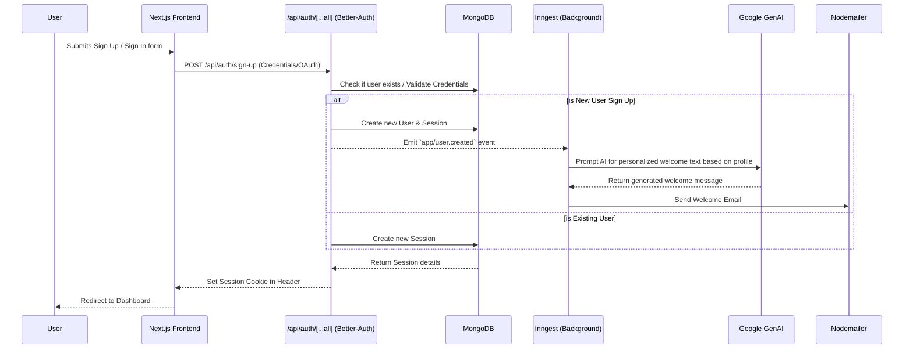
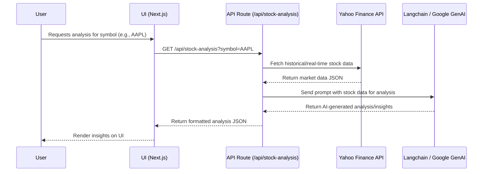
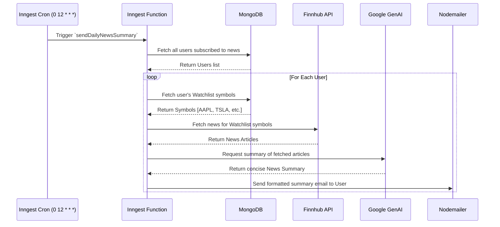

# Stock Market App - Architecture Documentation

## 1. High-Level Architecture Diagram

## 2. Entity-Relationship (ER) Diagram

*Note: User, Session, and Account entities are managed by the `better-auth` MongoDB adapter.*

## 3. Authentication Flow

## 4. Request / Sequence Flows

### 4.1 Stock Analysis Flow

### 4.2 Daily News Summary (Background Cron Job)

## 5. Technology Decision Sheet

| Category | Technology | Rationale / Use Case |
| :--- | :--- | :--- |
| **Framework** | Next.js (App Router) | Enables full-stack development within a single repository. Excellent for SEO, Server-Side Rendering (SSR), and seamless API integrations. |
| **Language** | TypeScript | Provides strict static typing, improving code reliability, developer experience, and reducing runtime errors. |
| **Database** | MongoDB & Mongoose | Flexible, document-based NoSQL database that accommodates rapid schema iteration. Perfect for storing diverse user profiles and watchlist items. |
| **Authentication** | Better-Auth | A modern, framework-agnostic auth solution that integrates easily with Next.js and MongoDB. Handles sessions, credentials, and OAuth out of the box. |
| **Background Jobs** | Inngest | Reliable event-driven and scheduled (Cron) background processing. Used for heavy tasks like batch emailing and AI generation without blocking API routes. |
| **AI / LLM** | Google Generative AI (Gemini) + Langchain | Powering intelligent features: summarizing market news and providing personalized stock analysis and tailored welcome emails. |
| **Financial Data** | Yahoo Finance API & Finnhub | `yahoo-finance2` for robust historical data and stock quotes; Finnhub for real-time market news corresponding to user watchlists. |
| **Email Service** | Nodemailer | Standard, reliable Node.js module for sending transactional emails (Welcome Emails, Daily News Summaries) over SMTP. |
| **Styling & UI** | Tailwind CSS + shadcn/ui | Utility-first styling for rapid, responsive UI development. `shadcn/ui` provides unstyled, accessible, and customizable React components (built on Radix UI). |
